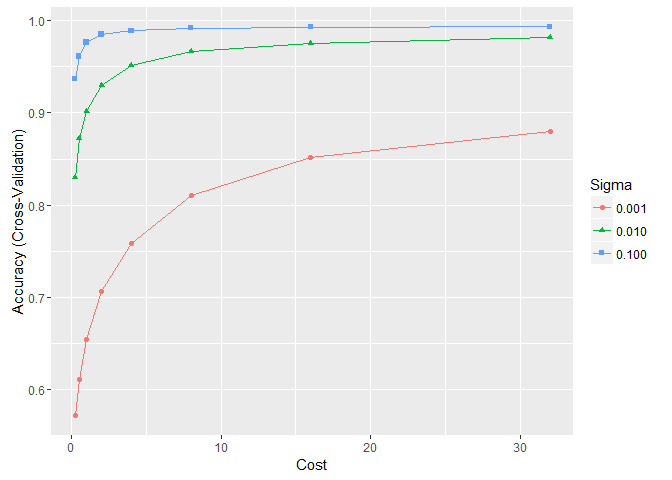
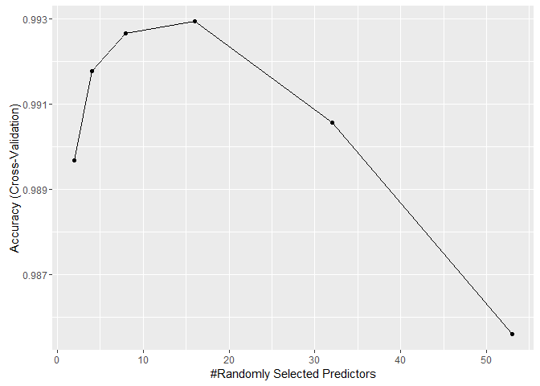
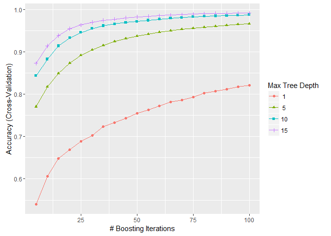
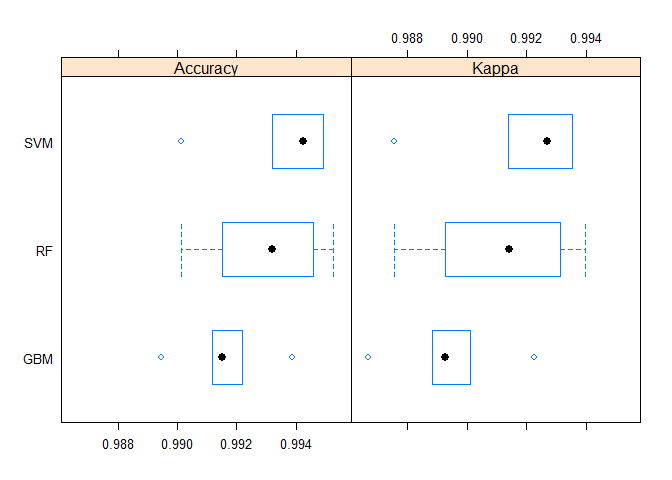

# Classification of Body Movements during Weight Lifting Exercises
Dmitry Belyaev  
10 April 2016  

## 1. Introduction

This course project is devoted to the Human Activity Recognition (HAR) problems in the sphere of development of the digital assistants for weight lifting exercises and based on the research of using accelerometers for classification of body postures and movements (Ugulino, W.; Cardador, D.; Vega, K.; Velloso, E.; Milidiu, R.; Fuks, H. Wearable Computing: Accelerometers' Data Classification of Body Postures and Movements. Proceedings of 21st Brazilian Symposium on Artificial Intelligence. Advances in Artificial Intelligence - SBIA 2012. In: Lecture Notes in Computer Science. , pp. 52-61. Curitiba, PR: Springer Berlin / Heidelberg, 2012 - http://groupware.les.inf.puc-rio.br/har).

The goal of the project is to predict the manner in which people do the exercises with free weights. 

## 2. Data Analysis and Feature Selection


```r
library(caret)
set.seed(314159)
```

### 2.1. Exploring the Datasets

The source dataset was downloaded using the links supplied in the course project task:

* the training dataset - https://d396qusza40orc.cloudfront.net/predmachlearn/pml-training.csv
* the test dataset - https://d396qusza40orc.cloudfront.net/predmachlearn/pml-testing.csv


```r
raw_train <- read.csv("./PML_CP_Data/pml-training.csv", row.names = 1)
raw_test <- read.csv("./PML_CP_Data/pml-testing.csv", row.names = 1)
```

Training dataset contains **19622 observations** and **159 variables** describing the Unilateral Dumbbell Biceps Curl exercises performed by six male participants of experiment. They were asked to perform sets of 10 repetitions in 5 different fashions (variable *classe*):


```r
table(raw_train$classe)
```

```
## 
##    A    B    C    D    E 
## 5580 3797 3422 3216 3607
```

* A - exactly according to the specification;
* B - with throwing the elbows to the front;
* C - with lifting the dumbbell only halfway;
* D - with lowering the dumbbell only halfway;
* E - with throwing the hips to the front.

Class A corresponds to the proper execution of the exercise, and other classes correspond to common mistakes.

Other variables describe:

* attributes and conditions of observations (6 variables *user_name*, *raw_timestamp_part_1*, *raw_timestamp_part_2*, *cvtd_timestamp*, *new_window*, and *num_window*);
* measurements obtained from sensors placed on the participant’s belt, arm, forearm, and dumbbell (153 variables with corresponding suffixes “\_belt”, “\_arm”, “\_forearm”, and “\_dumbbell”).

The testing dataset includes **20 observations** with the same set of variables as in the training one except the variable “classe” which should be predicted.

### 2.2. Choosing of Predictors

As it was mentioned above, both datasets contain variables which don’t relate directly to the way of performing the physical exercises. For example, the variable participant could be important because different people doing the same exercises in a unique way. On the other hand, mistakes occurring during exercises must be recognized regardless of person performing the exercises. 

Therefore, only the variables with numerical measurements obtained from sensors was left as the predictors:


```r
sensors_train <- grep("_(belt|forearm|arm|dumbbell)|classe",
                      names(raw_train))
sensors_test <- grep("_(belt|forearm|arm|dumbbell)",
                     names(raw_test))

names(raw_train)[setdiff(sensors_train, sensors_test)]
```

```
## [1] "classe"
```

```r
raw_train <- raw_train[, sensors_train]
raw_test <- raw_test[, sensors_test]

numeric_cols <- sapply(raw_train, is.numeric)
raw_test <- raw_test[, numeric_cols]
numeric_cols["classe"] = TRUE
raw_train <- raw_train[, numeric_cols]
```

### 2.3. Cleaning the Raw Data

Exploratory datasets analysis has shown that a number of data variables include empty values, NAs and signs of calculating error (“#DIV/0!”).

There are many different ways to deal with the gaps in a raw data. Sometimes it’s possible to replace the gaps in raw data, but in our case the amount of gaps is quite big. In the traning dataset 67 variables with gaps have less then 3% of informative observations:


```r
na_vars <- apply(raw_train, 2, function(x) { sum(is.na(x)) })
na_vars <- round(100 * na_vars[na_vars > 0.97] / dim(raw_train)[1], 1)
names(na_vars)
```

```
##  [1] "max_roll_belt"            "max_picth_belt"          
##  [3] "min_roll_belt"            "min_pitch_belt"          
##  [5] "amplitude_roll_belt"      "amplitude_pitch_belt"    
##  [7] "var_total_accel_belt"     "avg_roll_belt"           
##  [9] "stddev_roll_belt"         "var_roll_belt"           
## [11] "avg_pitch_belt"           "stddev_pitch_belt"       
## [13] "var_pitch_belt"           "avg_yaw_belt"            
## [15] "stddev_yaw_belt"          "var_yaw_belt"            
## [17] "var_accel_arm"            "avg_roll_arm"            
## [19] "stddev_roll_arm"          "var_roll_arm"            
## [21] "avg_pitch_arm"            "stddev_pitch_arm"        
## [23] "var_pitch_arm"            "avg_yaw_arm"             
## [25] "stddev_yaw_arm"           "var_yaw_arm"             
## [27] "max_roll_arm"             "max_picth_arm"           
## [29] "max_yaw_arm"              "min_roll_arm"            
## [31] "min_pitch_arm"            "min_yaw_arm"             
## [33] "amplitude_roll_arm"       "amplitude_pitch_arm"     
## [35] "amplitude_yaw_arm"        "max_roll_dumbbell"       
## [37] "max_picth_dumbbell"       "min_roll_dumbbell"       
## [39] "min_pitch_dumbbell"       "amplitude_roll_dumbbell" 
## [41] "amplitude_pitch_dumbbell" "var_accel_dumbbell"      
## [43] "avg_roll_dumbbell"        "stddev_roll_dumbbell"    
## [45] "var_roll_dumbbell"        "avg_pitch_dumbbell"      
## [47] "stddev_pitch_dumbbell"    "var_pitch_dumbbell"      
## [49] "avg_yaw_dumbbell"         "stddev_yaw_dumbbell"     
## [51] "var_yaw_dumbbell"         "max_roll_forearm"        
## [53] "max_picth_forearm"        "min_roll_forearm"        
## [55] "min_pitch_forearm"        "amplitude_roll_forearm"  
## [57] "amplitude_pitch_forearm"  "var_accel_forearm"       
## [59] "avg_roll_forearm"         "stddev_roll_forearm"     
## [61] "var_roll_forearm"         "avg_pitch_forearm"       
## [63] "stddev_pitch_forearm"     "var_pitch_forearm"       
## [65] "avg_yaw_forearm"          "stddev_yaw_forearm"      
## [67] "var_yaw_forearm"
```

In this case filling the gaps by constant values (zeros, means e t.c.) will enlarge the data collinearity which can lead to an increase of the classification errors.

Considering the above, all variables with gaps and errors were excluded of the training and testing datasets:


```r
na_cols <- colSums(is.na(raw_train)) == 0
tidy_train <- raw_train[, na_cols]
na_cols <- na_cols[names(na_cols) != "classe"]
tidy_test <- raw_test[, na_cols]

tidy_train$classe <- as.factor(tidy_train$classe)
```

## 3. Model Selection and Tuning

In order to select the multiclass classification model next type of classifiers was tuned and fitted:

* Support Vector Machine classifiers (“svmRadial”) ;
* Random Forest classifier ("rf");
* Gradient Boosting Trees classifier ("gbm").

### 3.1. Training and Testing Datasets 

To prepare the training dataset to the process of tuning and fitting classifiers it was split into *training* and *testing* datasets with sizes of 75% and 25% respectively:


```r
in_train <- createDataPartition(y = tidy_train$classe, p = 0.75, list = FALSE)
training <- tidy_train[in_train, ]
testing <- tidy_train[-in_train, ]
```

(Note: now we have two datasets for testing routines on different stages:

* *testing* dataset was used to model selection and tuning;
* *tidy_test* dataset was used to final classification.)

### 3.2. Cross-validation parameters

Tuning of the parameters of each model was made by the K-fold Cross-Validation with K=5:


```r
fit_control <- trainControl(
        method = "cv",
        number = 5,
        verboseIter = FALSE)
```

### 3.2. Fitting classifiers 

The training function was used to evaluate the effect of model tuning parameters on classification performance (to choose “the best” model parameters) and estimate the model performance on the training set.

#### 3.2.1. Support Vector Machine

The grid of parameters for Support Vector Machine classifier includes the next parameters and their values:

* cost parameter C -  0.25, 0.5, 1, 2, 4, 8, 16, 32;
* kernel parameter $\sigma$ - 0.001, 0.01, 0.1.


```r
svm_grid <- expand.grid(C = c(0.25, 0.5, 1, 2, 4, 8, 16, 32),
                        sigma = c(0.001, 0.01, 0.1)
)

fit_svm <- train(classe ~ ., data = training,
                 method = "svmRadial",
                 trControl = fit_control,
                 tuneGrid = svm_grid,
                 preProc = c("center", "scale"),
                 verbose = FALSE)
```

Values "Accuracy" and “Kappa” are the overall agreement rate and Cohen's (unweighted) Kappa statistic respectively averaged over cross-validation iterations.


```r
fit_svm
```

```
## Support Vector Machines with Radial Basis Function Kernel 
## 
## 14718 samples
##    52 predictor
##     5 classes: 'A', 'B', 'C', 'D', 'E' 
## 
## Pre-processing: centered (52), scaled (52) 
## Resampling: Cross-Validated (5 fold) 
## Summary of sample sizes: 11774, 11774, 11776, 11772, 11776 
## Resampling results across tuning parameters:
## 
##   C      sigma  Accuracy   Kappa      Accuracy SD  Kappa SD   
##    0.25  0.001  0.5715471  0.4493621  0.008144973  0.010966329
##    0.25  0.010  0.8304794  0.7852530  0.010867891  0.013781122
##    0.25  0.100  0.9364724  0.9195393  0.003503549  0.004414157
##    0.50  0.001  0.6106128  0.5030958  0.005525487  0.007138874
##    0.50  0.010  0.8719921  0.8376958  0.004953257  0.006337504
##    0.50  0.100  0.9613400  0.9510542  0.003339493  0.004214537
##    1.00  0.001  0.6547767  0.5604823  0.007771451  0.009433022
##    1.00  0.010  0.9012767  0.8748176  0.003676211  0.004701735
##    1.00  0.100  0.9764238  0.9701634  0.002804145  0.003542855
##    2.00  0.001  0.7066171  0.6269830  0.009678849  0.012338231
##    2.00  0.010  0.9301524  0.9114591  0.003652037  0.004618213
##    2.00  0.100  0.9851887  0.9812611  0.003022296  0.003825235
##    4.00  0.001  0.7590011  0.6938258  0.007460673  0.009395579
##    4.00  0.010  0.9510112  0.9379436  0.003858595  0.004870496
##    4.00  0.100  0.9892649  0.9864194  0.002995847  0.003790535
##    8.00  0.001  0.8105015  0.7594662  0.008310789  0.010593308
##    8.00  0.010  0.9665030  0.9575824  0.002245053  0.002845041
##    8.00  0.100  0.9919148  0.9897728  0.003088511  0.003906716
##   16.00  0.001  0.8515418  0.8116745  0.007464784  0.009521854
##   16.00  0.010  0.9756084  0.9691256  0.002474525  0.003129635
##   16.00  0.100  0.9928657  0.9909757  0.002188574  0.002768565
##   32.00  0.001  0.8800112  0.8478245  0.003937014  0.005014702
##   32.00  0.010  0.9822666  0.9775611  0.003621794  0.004582616
##   32.00  0.100  0.9934774  0.9917495  0.001986347  0.002512564
## 
## Accuracy was used to select the optimal model using  the largest value.
## The final values used for the model were sigma = 0.1 and C = 32.
```

```r
ggplot(fit_svm)
```

 

As you can see, the best model parameters (among the parameter in the grid) are C = 0.1 and $\sigma$ = 32. They provide the **0.9976 level of accuracy** on the testing dataset:


```r
test_predict_svm <- predict(fit_svm, testing)
confusionMatrix(test_predict_svm, testing$classe)
```

```
## Confusion Matrix and Statistics
## 
##           Reference
## Prediction    A    B    C    D    E
##          A 1393    0    0    0    0
##          B    1  949    0    0    0
##          C    0    0  851    2    1
##          D    0    0    4  800    1
##          E    1    0    0    2  899
## 
## Overall Statistics
##                                           
##                Accuracy : 0.9976          
##                  95% CI : (0.9957, 0.9987)
##     No Information Rate : 0.2845          
##     P-Value [Acc > NIR] : < 2.2e-16       
##                                           
##                   Kappa : 0.9969          
##  Mcnemar's Test P-Value : NA              
## 
## Statistics by Class:
## 
##                      Class: A Class: B Class: C Class: D Class: E
## Sensitivity            0.9986   1.0000   0.9953   0.9950   0.9978
## Specificity            1.0000   0.9997   0.9993   0.9988   0.9993
## Pos Pred Value         1.0000   0.9989   0.9965   0.9938   0.9967
## Neg Pred Value         0.9994   1.0000   0.9990   0.9990   0.9995
## Prevalence             0.2845   0.1935   0.1743   0.1639   0.1837
## Detection Rate         0.2841   0.1935   0.1735   0.1631   0.1833
## Detection Prevalence   0.2841   0.1937   0.1741   0.1642   0.1839
## Balanced Accuracy      0.9993   0.9999   0.9973   0.9969   0.9985
```

#### 3.2.2. Random Forest Classifier

The grid of parameters for Random Forest classifier includes only one parameter which can be tuned - the number of randomly selected predictors *mtry* = 2, 4, 8, 16, …, up to the total number of predictors. (It is strange that the forest size - the "number of trees to grow" can't be tuned.)


```r
rf_grid <- expand.grid(mtry = c(2, 4, 8, 16, 32, dim(training)[2]))

fit_rf <- train(classe ~ ., data = training,
                method = "rf",
                trControl = fit_control,
                tuneGrid = rf_grid)
```

The best model parameter *mtry* is equal to 16:


```r
fit_rf
```

```
## Random Forest 
## 
## 14718 samples
##    52 predictor
##     5 classes: 'A', 'B', 'C', 'D', 'E' 
## 
## No pre-processing
## Resampling: Cross-Validated (5 fold) 
## Summary of sample sizes: 11774, 11775, 11775, 11774, 11774 
## Resampling results across tuning parameters:
## 
##   mtry  Accuracy   Kappa      Accuracy SD  Kappa SD   
##    2    0.9896724  0.9869332  0.003100590  0.003925455
##    4    0.9917787  0.9895990  0.002646872  0.003349897
##    8    0.9926618  0.9907166  0.002515592  0.003183289
##   16    0.9929337  0.9910608  0.002113502  0.002674624
##   32    0.9905557  0.9880522  0.002140456  0.002709831
##   53    0.9855960  0.9817762  0.004065650  0.005146727
## 
## Accuracy was used to select the optimal model using  the largest value.
## The final value used for the model was mtry = 16.
```

```r
ggplot(fit_rf)
```

 

It provides the **0.9947 level of accuracy** on the testing dataset:


```r
test_predict_rf <- predict(fit_rf, testing)
confusionMatrix(test_predict_rf, testing$classe)
```

```
## Confusion Matrix and Statistics
## 
##           Reference
## Prediction    A    B    C    D    E
##          A 1395    3    0    0    0
##          B    0  943    2    0    0
##          C    0    3  851    8    2
##          D    0    0    2  795    5
##          E    0    0    0    1  894
## 
## Overall Statistics
##                                           
##                Accuracy : 0.9947          
##                  95% CI : (0.9922, 0.9965)
##     No Information Rate : 0.2845          
##     P-Value [Acc > NIR] : < 2.2e-16       
##                                           
##                   Kappa : 0.9933          
##  Mcnemar's Test P-Value : NA              
## 
## Statistics by Class:
## 
##                      Class: A Class: B Class: C Class: D Class: E
## Sensitivity            1.0000   0.9937   0.9953   0.9888   0.9922
## Specificity            0.9991   0.9995   0.9968   0.9983   0.9998
## Pos Pred Value         0.9979   0.9979   0.9850   0.9913   0.9989
## Neg Pred Value         1.0000   0.9985   0.9990   0.9978   0.9983
## Prevalence             0.2845   0.1935   0.1743   0.1639   0.1837
## Detection Rate         0.2845   0.1923   0.1735   0.1621   0.1823
## Detection Prevalence   0.2851   0.1927   0.1762   0.1635   0.1825
## Balanced Accuracy      0.9996   0.9966   0.9961   0.9935   0.9960
```

#### 3.2.3. Gradient Boosting Classifier

The grid of parameters for Gradient Boosting classifier includes the next parameters and their values:
- boosting iterations (number of trees) = 5, 10, 15, …, 100;
- maximum tree depth - 1, 5, 10, 15.

Other parameters available for tuning was taken as default constants (shrinkage = 0.1, terminal node size = 20) for reasons of cross-validation and fitting time reduction.


```r
gbm_grid <- expand.grid(interaction.depth = c(1, 5, 10, 15),
                        n.trees = (1:20) * 5,
                        shrinkage = 0.1,
                        n.minobsinnode = 20)

fit_gbm <- train(classe ~ ., data = training,
                 method = "gbm",
                 trControl = fit_control,
                 tuneGrid = gbm_grid,
                 verbose = FALSE)
```

The best model parameters (among the tuning parameter grid) are interection.depth = 15, n.trees = 100:


```r
fit_gbm
```

```
## Stochastic Gradient Boosting 
## 
## 14718 samples
##    52 predictor
##     5 classes: 'A', 'B', 'C', 'D', 'E' 
## 
## No pre-processing
## Resampling: Cross-Validated (5 fold) 
## Summary of sample sizes: 11774, 11773, 11774, 11775, 11776 
## Resampling results across tuning parameters:
## 
##   interaction.depth  n.trees  Accuracy   Kappa      Accuracy SD 
##    1                   5      0.5396757  0.4168485  0.0222889959
##    1                  10      0.6066720  0.4957716  0.0211128802
##    1                  15      0.6479792  0.5487992  0.0151325445
##    1                  20      0.6687024  0.5764052  0.0129933613
##    1                  25      0.6885424  0.6032796  0.0085016688
##    1                  30      0.7022004  0.6209301  0.0089087855
##    1                  35      0.7241455  0.6495816  0.0105689951
##    1                  40      0.7327750  0.6607999  0.0124128652
##    1                  45      0.7435089  0.6746183  0.0144916678
##    1                  50      0.7551284  0.6895606  0.0112262390
##    1                  55      0.7634168  0.7001891  0.0128977827
##    1                  60      0.7721817  0.7113450  0.0119856192
##    1                  65      0.7822376  0.7241441  0.0123874286
##    1                  70      0.7868571  0.7301040  0.0131384415
##    1                  75      0.7937877  0.7388645  0.0113129827
##    1                  80      0.8022121  0.7495629  0.0147932065
##    1                  85      0.8077848  0.7566938  0.0117710291
##    1                  90      0.8122006  0.7622658  0.0118711253
##    1                  95      0.8181121  0.7697676  0.0102730380
##    1                 100      0.8215096  0.7740869  0.0078431273
##    5                   5      0.7706892  0.7100413  0.0075952646
##    5                  10      0.8175693  0.7689677  0.0091403300
##    5                  15      0.8488894  0.8085105  0.0124139991
##    5                  20      0.8730771  0.8391429  0.0126058757
##    5                  25      0.8917638  0.8628749  0.0072420591
##    5                  30      0.9045371  0.8791044  0.0067494491
##    5                  35      0.9153404  0.8928000  0.0060416123
##    5                  40      0.9240376  0.9038243  0.0054238485
##    5                  45      0.9313753  0.9131284  0.0058880284
##    5                  50      0.9372191  0.9205390  0.0036762751
##    5                  55      0.9418395  0.9263905  0.0036786437
##    5                  60      0.9465955  0.9324151  0.0034444557
##    5                  65      0.9496531  0.9362867  0.0023332994
##    5                  70      0.9531181  0.9406778  0.0019086994
##    5                  75      0.9554285  0.9435989  0.0016437977
##    5                  80      0.9580101  0.9468634  0.0020733949
##    5                  85      0.9609318  0.9505647  0.0017260008
##    5                  90      0.9632419  0.9534887  0.0016996754
##    5                  95      0.9647369  0.9553823  0.0012158470
##    5                 100      0.9664356  0.9575324  0.0021690447
##   10                   5      0.8434563  0.8015092  0.0046090168
##   10                  10      0.8826592  0.8513025  0.0070592168
##   10                  15      0.9141852  0.8913368  0.0064631112
##   10                  20      0.9332096  0.9154410  0.0055026623
##   10                  25      0.9457115  0.9312840  0.0046957760
##   10                  30      0.9552243  0.9433300  0.0027644365
##   10                  35      0.9616793  0.9515057  0.0022395170
##   10                  40      0.9658920  0.9568382  0.0010942966
##   10                  45      0.9696289  0.9615706  0.0014554051
##   10                  50      0.9717353  0.9642362  0.0022197717
##   10                  55      0.9745888  0.9678516  0.0007429715
##   10                  60      0.9770350  0.9709465  0.0013495728
##   10                  65      0.9794809  0.9740411  0.0019892504
##   10                  70      0.9811117  0.9761047  0.0015090450
##   10                  75      0.9828102  0.9782542  0.0017423918
##   10                  80      0.9841012  0.9798881  0.0013874394
##   10                  85      0.9849843  0.9810060  0.0016371805
##   10                  90      0.9855959  0.9817801  0.0011661383
##   10                  95      0.9866150  0.9830688  0.0014133421
##   10                 100      0.9874304  0.9841008  0.0014805607
##   15                   5      0.8731470  0.8391901  0.0083422971
##   15                  10      0.9139139  0.8909408  0.0040666108
##   15                  15      0.9384421  0.9220568  0.0028954442
##   15                  20      0.9547487  0.9427274  0.0025146184
##   15                  25      0.9638537  0.9542611  0.0017112564
##   15                  30      0.9700368  0.9620898  0.0015610989
##   15                  35      0.9745212  0.9677636  0.0019029230
##   15                  40      0.9773748  0.9713771  0.0019728045
##   15                  45      0.9802282  0.9749883  0.0023471674
##   15                  50      0.9827422  0.9781696  0.0020854991
##   15                  55      0.9843051  0.9801465  0.0017201025
##   15                  60      0.9857319  0.9819512  0.0023277661
##   15                  65      0.9869548  0.9834987  0.0022861621
##   15                  70      0.9882455  0.9851316  0.0027247380
##   15                  75      0.9892647  0.9864210  0.0023245003
##   15                  80      0.9904198  0.9878822  0.0015827821
##   15                  85      0.9910313  0.9886559  0.0014929882
##   15                  90      0.9913030  0.9889995  0.0016405675
##   15                  95      0.9914390  0.9891716  0.0016882435
##   15                 100      0.9916428  0.9894294  0.0016046104
##   Kappa SD    
##   0.0224559240
##   0.0297391875
##   0.0201666919
##   0.0173930057
##   0.0109677583
##   0.0113020346
##   0.0133705777
##   0.0157704351
##   0.0184520957
##   0.0141674184
##   0.0163071142
##   0.0151697439
##   0.0156002087
##   0.0165730201
##   0.0142786842
##   0.0186812615
##   0.0147980725
##   0.0149608400
##   0.0129518782
##   0.0098658691
##   0.0097468759
##   0.0116483660
##   0.0157609188
##   0.0160316351
##   0.0092394374
##   0.0085729237
##   0.0076750572
##   0.0068747278
##   0.0074626899
##   0.0046655996
##   0.0046615391
##   0.0043672842
##   0.0029542837
##   0.0024136331
##   0.0020787032
##   0.0026246607
##   0.0021840056
##   0.0021497073
##   0.0015384181
##   0.0027412906
##   0.0058253756
##   0.0089284237
##   0.0081786713
##   0.0069678755
##   0.0059419540
##   0.0034953216
##   0.0028376459
##   0.0013873669
##   0.0018472691
##   0.0028172995
##   0.0009392517
##   0.0017091896
##   0.0025191396
##   0.0019108112
##   0.0022055707
##   0.0017559602
##   0.0020708404
##   0.0014758361
##   0.0017883242
##   0.0018732886
##   0.0105865000
##   0.0051432634
##   0.0036555620
##   0.0031898054
##   0.0021595174
##   0.0019708313
##   0.0024032472
##   0.0024904534
##   0.0029671635
##   0.0026368019
##   0.0021746754
##   0.0029436738
##   0.0028904168
##   0.0034454042
##   0.0029396451
##   0.0020016144
##   0.0018881391
##   0.0020749888
##   0.0021350656
##   0.0020293698
## 
## Tuning parameter 'shrinkage' was held constant at a value of 0.1
## 
## Tuning parameter 'n.minobsinnode' was held constant at a value of 20
## Accuracy was used to select the optimal model using  the largest value.
## The final values used for the model were n.trees = 100,
##  interaction.depth = 15, shrinkage = 0.1 and n.minobsinnode = 20.
```

```r
ggplot(fit_gbm)
```

 

They provide the **0.9947 level of accuracy** on the testing dataset:


```r
test_predict_gbm <- predict(fit_gbm, testing)
confusionMatrix(test_predict_gbm, testing$classe)
```

```
## Confusion Matrix and Statistics
## 
##           Reference
## Prediction    A    B    C    D    E
##          A 1394    1    0    0    0
##          B    0  945    3    0    0
##          C    1    3  847    7    2
##          D    0    0    5  796    3
##          E    0    0    0    1  896
## 
## Overall Statistics
##                                           
##                Accuracy : 0.9947          
##                  95% CI : (0.9922, 0.9965)
##     No Information Rate : 0.2845          
##     P-Value [Acc > NIR] : < 2.2e-16       
##                                           
##                   Kappa : 0.9933          
##  Mcnemar's Test P-Value : NA              
## 
## Statistics by Class:
## 
##                      Class: A Class: B Class: C Class: D Class: E
## Sensitivity            0.9993   0.9958   0.9906   0.9900   0.9945
## Specificity            0.9997   0.9992   0.9968   0.9980   0.9998
## Pos Pred Value         0.9993   0.9968   0.9849   0.9900   0.9989
## Neg Pred Value         0.9997   0.9990   0.9980   0.9980   0.9988
## Prevalence             0.2845   0.1935   0.1743   0.1639   0.1837
## Detection Rate         0.2843   0.1927   0.1727   0.1623   0.1827
## Detection Prevalence   0.2845   0.1933   0.1754   0.1639   0.1829
## Balanced Accuracy      0.9995   0.9975   0.9937   0.9940   0.9971
```

As we can see, Accuracy of Gradient Boosting model increases monotonically with the number of trees, which demonstrates the ability to improve the generalization abilities with increasing of model complexity. The greatest value of Accuracy was obtained on the right border of the considered interval with the number of trees equal to 100.

Thus, if it is necessary to increase the accuracy of the model, it is possible to increase the number of trees and maximum tree depth. However, the quality of the growth rate slows down. It can lead to a dramatic increase in computing time and cost of training patterns.

### 3.4. Model comparison

On the testing data Support Vector Machine classifier showed the best accurasy - 0.9976 (12 mistakes per 4904 ovservations), while two other models - Random Forest and Gradient Boosting - reached the same lavel of 0.9947 accuracy (26 mistakes per 4904 observations).

At the same time, on the cross-validation tests Random Forest reached the better accuracy then Gradient Boosting:


```r
resamps <- resamples(list(GBM = fit_gbm,
                          SVM = fit_svm,
                          RF = fit_rf))
summary(resamps)
```

```
## 
## Call:
## summary.resamples(object = resamps)
## 
## Models: GBM, SVM, RF 
## Number of resamples: 5 
## 
## Accuracy 
##       Min. 1st Qu. Median   Mean 3rd Qu.   Max. NA's
## GBM 0.9895  0.9912 0.9915 0.9916  0.9922 0.9939    0
## SVM 0.9901  0.9932 0.9942 0.9935  0.9949 0.9949    0
## RF  0.9901  0.9915 0.9932 0.9929  0.9946 0.9952    0
## 
## Kappa 
##       Min. 1st Qu. Median   Mean 3rd Qu.   Max. NA's
## GBM 0.9867  0.9888 0.9893 0.9894  0.9901 0.9923    0
## SVM 0.9875  0.9914 0.9927 0.9917  0.9935 0.9936    0
## RF  0.9875  0.9893 0.9914 0.9911  0.9931 0.9940    0
```

```r
bwplot(resamps, layout = c(2, 1))
```

 


```r
diffs <- diff(resamps)
bwplot(diffs, layout = c(2, 1))
```

 

It should be noted, that this calculating experiment was performed on the fitting parameters combined with a sufficiently large steps. Therefore, the choice of fitting parameters was not made quite accurate.

Furthermore, as it was shown above: Gradient Boosting model can be fitted much better if more computational resouces are present.

## 4. Fitting the final models and final classification

The final model was fitted on the full training dataset (*tidy_train*) with the best parameters obtained during the cross-validation routine:


```r
svm_final_grid <- expand.grid(C = 32, sigma = 0.1)
fit_final_svm <- train(classe ~ ., data = tidy_train,
                       method = "svmRadial",
                       tuneGrid = svm_final_grid,
                       preProc = c("center", "scale"),
                       verbose = FALSE)
```


```r
rf_final_grid <- expand.grid(mtry = 16)
fit_final_rf <- train(classe ~ ., data = tidy_train,
                      method = "rf",
                      tuneGrid = rf_final_grid)
```


```r
gbm_final_grid <- expand.grid(interaction.depth = 15,
                              n.trees = 100,
                              shrinkage = 0.1,
                              n.minobsinnode = 20)
fit_final_gbm <- train(classe ~ ., data = tidy_train,
                       method = "gbm",
                       tuneGrid = gbm_final_grid,
                       verbose = FALSE)
```

Final prediction was done on the testing dataset (tidy_tedt). As we can see, all three classifiers showed the equal classification results:  


```r
final_predict_svm <- predict(fit_final_svm, tidy_test)
final_predict_rf <- predict(fit_final_rf, tidy_test)
final_predict_gbm <- predict(fit_final_gbm, tidy_test)

final_predict_svm
```

```
##  [1] B A B A A E D B A A B C B A E E A B B B
## Levels: A B C D E
```

```r
final_predict_rf
```

```
##  [1] B A B A A E D B A A B C B A E E A B B B
## Levels: A B C D E
```

```r
final_predict_gbm
```

```
##  [1] B A B A A E D B A A B C B A E E A B B B
## Levels: A B C D E
```

## 5. Conclusion

All fitted models - Support Vector Machine, Random Forest, and Gradient Boosting showed good and consistent results on the testing dataset in terms of classification accuracy. The best accuracy was obtained on the Support Vector Machine model.

During the computational experiment the top limit of Gradient Boosting classification quality was not reached. This means that GBM can be fitted potentially better, but it will require substantially more resources (time and memory) for fitting.
